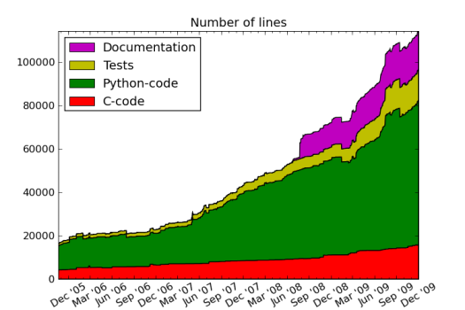

.. _devel:

===========
Development
===========

GPAW development can be done by anyone! Just take a look at the
:ref:`todo` list and find something that suits your talents!

The primary source of information is still the :ref:`manual` and
:ref:`documentation`, but as a developer you might need additional
information which can be found here. For example the :ref:`code_overview`.

As a developer, you should subscribe to all GPAW related :ref:`mailing_lists`.

Now you are ready to to perfom a :ref:`developer_installation` and
start development!

.. toctree::
   :maxdepth: 1

   developer_installation

.. note --- below toctrees are defined in separate files to make sure that the line spacing doesn't get very large (which is of course a bad hack)

Development topics
==================

When committing significant changes to the code, remember to add a
note in the :ref:`releasenotes` at the top (current svn) - the version
to become the next release.

.. toctree::
   :maxdepth: 1

   toc-general

* Supported :ref:`platforms_and_architectures`.
* A report_ from PyLint.

.. _report: http://wiki.fysik.dtu.dk/stuff/pylint_global.html

.. _code_overview:

Code Overview
=============

The developer guide provides an overview of the PAW quantities and how
the corresponding objects are defined in the code:

.. toctree::
   :maxdepth: 2

   overview
   developersguide
   paw
   wavefunctions
   setups
   density_and_hamiltonian
   others

.. _the_big_picture:

The big picture
===============

The old (outdated) "The big picture" created with OpenOffice.org-Draw_
can be found here: overview.odg_, overview.pdf_

.. _OpenOffice.org-Draw: http://www.openoffice.org/product/draw.html
.. _overview.pdf: ../_static/overview.pdf
.. _overview.odg: ../_static/overview.odg

The GPAW logo
=============

The GPAW-logo is available in the odg_ and svg_ file formats:
gpaw-logo.odg_, gpaw-logo.svg_

.. _odg: http://www.openoffice.org/product/draw.html
.. _svg: http://en.wikipedia.org/wiki/Scalable_Vector_Graphics
.. _gpaw-logo.odg: ../_static/gpaw-logo.odg
.. _gpaw-logo.svg: ../_static/gpaw-logo.svg

Statistics
==========

The image below shows the development in the volume of the code as per
July 24 2009.

*Documentation* refers solely the contents of this homepage. Inline
documentation is included in the other line counts.

.. ::

   Commented text!

   The gpaw development project currently count about 20 active
   developers in 7 universities, and has 93 subscribers to the mailing
   list.

Old pages
=========

These pages may contain inaccurate or outdated information

.. toctree::
   :maxdepth: 1

   bugs
   testsuite
