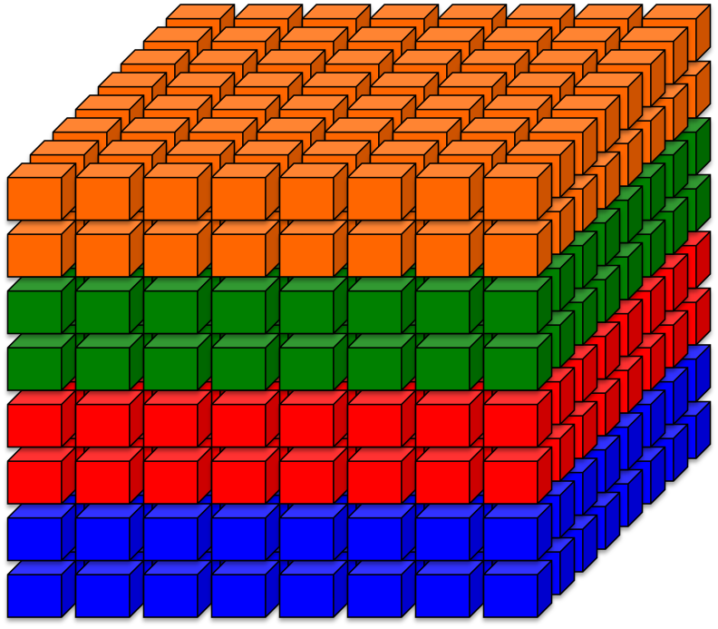
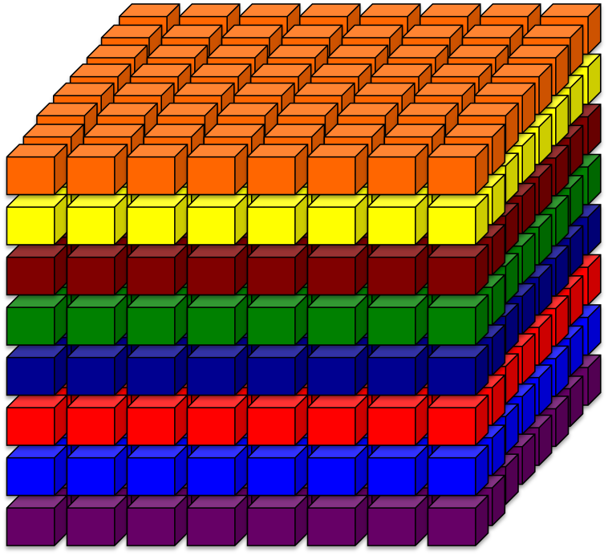

.. _performance:

======================
Maximizing performance
======================

If you haven't done so already, this is a good point to read up on the
GPAW parallelization strategies (:ref:`parallel_runs`) and the BG/P
architecture.  In particular, :ref:`band_parallelization`
will be needed to scale your calculation to large number of cores. The BG/P
systems at Argonne National Laboratory uses Cobalt for scheduling and
it will be referred to frequently below. Other schedulers should have
similar functionality.

There are four key points that will require careful considerations:
1. Choosing a parallelization strategy
2. Selecting the correct partion size and mapping
3. Choosing an appropriate value of *nblocks*
4. Setting the appropriate DCMF environmental variables.

In the section that follows, we aim to cultivate an understanding of
how these parameters are chosen.

Parallelization Strategy
====================================

Parallelization options are specified at the ``gpaw-python`` command
line.  Domain decomposition  with ``--domain-decomposition=Nx,Ny,Nz``
and band parallelization with ``--state-parallelization=B``. Here *nbands*
is divided into *B* groups. It was empirically determined that you need to
have *nbands/B > 256* for reasonable performance. It is possible to get
away with smaller values, *N/B < 256*, but this may require large
domains. It is *required* that *nbands/B* be integer divisible. The
easiest values of B =2, 4, 8, 16, 32, 64, and 128.

Obviously, the number of nodes must equal::
  
   Nx*Ny*Nz*B

Partition size and Mapping 
========================================
The BG/P partition dimensions (Px, Py, Pz, T) for Surveyor and Intrepid at the
Argonne Leadership Computing Facility are `available here 
<https://wiki.alcf.anl.gov/index.php/Running#What_are_the_sizes_and_dimensions_of_the_partitions_on_the_system.3F>`_,
where T represents the number of cores (not whether a
torus network is available). The number of cores per node with
MPI tasks is specified by the Cobalt flag::

  --mode={smp,dual,vn}

where smp, dual and vn are for 1, 2, and 4, MPI tasks respectively. Note that
there are 4 cores per node and 2 GB per node on BG/P. As GPAW is
presently an MPI-only code, vn mode is preferred since all cores will
be perform computational work.

It is essential to think of the BG/P network as a 4-dimensional object with
3 spatial dimentions and a T-dimension. For optimum scalability it
would seem necessary to maximize the locality of two distinct
communications patterns arising in the canonical O(N^3) DFT algorithm: 
a) H*Psi products  b) parallel matrix multiplies. However, it turns
out this is *not*  necessary. The mesh network can handle small messages
rather efficiently such that the time to send a small message to a
nearest-neighbor node versus a node half-way across the machine is
comparable. Hence, it is only necessary to optimize the mapping for
the communication arising from the parallel matrix multiply which is
a simple 1D systolic communication pattern.

Here we show the examples of different mappings on a 512-node BG/P
partition. Band groups are colored coded. *(Left)* Inefficient mapping
for four groups of bands (B = 4). This mapping leads to contention on
network links in z-direction. *(Right)*  Efficient mapping for eight
groups of bands (B=8). Correct mapping maximizes scalability and
single-core peak performance. 

|mapping1|		|mapping2|

  

There are some simple questions that are worth consideration.

B = 2
--------
Simply set the followin submission script settings::

  mode = dual
  mapping = ZYXT

B = 4
--------
Similar to the *B=2* case::

  mode = vn
  mapping = ZYXT

B = 8 or 16
---------------
It will be necessary to have the combined band-domain decomposition
match the partition dimension exactly, i.e.::

  {Nx, Ny, Nz, B} = {Px, Py, Pz, T},
  {Nx, Ny, Nz, B} = {T, Px, Py, Pz},
  {Nx, Ny, Nz, B} = {Px, T, Py, Pz}, 
  or another permutation.

This can be accomplised with the help of ``tools/mapfile.py.`` You will
want to use ``band`` mode to generate a BG/P mapfile for a  DFT calculation.
Since there is no orthogonalization in the rTDDFT method, one can use 
``domain`` mode to satisfy the communiation pattern of the H*Psi
products.  Remember to specify the mapfile via Cobalt::

  --env=BG_MAPPING=<mapfile>

B = 32, 64, or 128
------------------
Still working to finish documentation

Setting the value of nblocks
============================
It will be necessary to select appropriate values for the number of blocks ``nblocks``::

  from gpaw.hs_operators import MatrixOperator
  MatrixOperator.nblocks = K
  MatrixOperator.async = True (default)

where the ``B`` groups of bands are further divided into ``K``
blocks. It is also required that *nbands/B/K*,  The value of ``K``
should be chosen so that 2 MB of wavefunctions are sent/received. 
Larger chunks of wavefunctions can be interchanged by adjusting
appropriate Cobalt environment variables. 

Important DCMF environment variables
===============================================
`DCMF <http://dcmf.anl-external.org/wiki/index.php/Main_Page>`_  is one
of the lower layers in the BG/P implementation of MPI software stack. 

To understand th DCMF environment variables in greater detail, please read the
appropriate sections of the  IBM System Blue Gene Solution:  
`Blue Gene/P Application Development <http://www.redbooks.ibm.com/abstracts/sg247287.html?Open>`_ 

DCMF_EAGER
-----------------
The computation of the hamiltonian and overlap matrix elements, as well as
the computation of the new wavefunctions, is accomplished by a hand-coded 
parallel matrix-multiply ``hs_operators.py`` employing a 1D systolic
ring algorithm. Please refer to the details of :ref:`band parallelization <band_parallelization>`.

Communication and computation is overlapped to the extent allowed by the
hardware by using non-blocking sends (Isend)and receives (Irecv). It will be also be necessary to pass to Cobalt::

  --env=DCMF_EAGER=8388608

which corresponds to the larger size message that can be overlapped
(8 MB). Note that the
number is specified in bytes and not megabytes.

For larger blocks of wavefunctions, it may be necessary to increase
DCMF_RECFIFO as well. This will depend on whether you are using smp, dual
or vn mode. 

DCMF_REUSE_STORAGE
-------------------------
If you receive receive allocation error on MPI_Allreduce, please add the following
environment variables::

  --env=DCMF_REDUCE_REUSE_STORAGE=N:DCMF_ALLREDUCE_REUSE_STORAGE=N:DCMF_REDUCE=RECT

Please also report this on the GPAW user mailing list.
