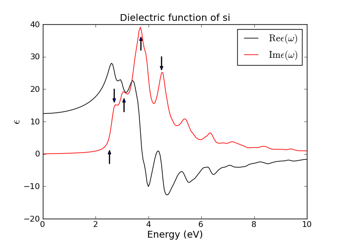
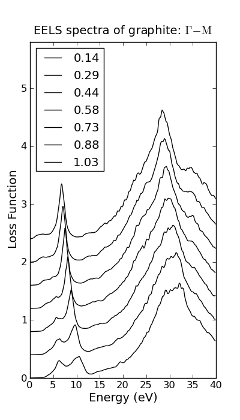

.. _df_tutorial:

==========================================================
Linear dielectric response of an extended system: tutorial
==========================================================

A short introduction
=====================

The DF (dielectric function) object calculates the RPA (random-phase approximation) 
dielectric function of an extended system 
from its ground state electronic structure. The frequency and wave-vector dependent linear dielectric 
matrix in reciprocal space representation is written as 

.. math:: \epsilon_{\mathbf{G} \mathbf{G}^{\prime}}(\mathbf{q}, \omega)

where :math:`\mathbf{q}` and  :math:`\omega` are the momentum and energy transfer in an excitation, and 
:math:`\mathbf{G}` is reciprocal lattice vector. The off-diagonal element of  
:math:`\epsilon_{\mathbf{G} \mathbf{G}^{\prime}}` determines the local field effect. 

The macroscopic dielectric function is defined by (with local field correction)

.. math:: \epsilon_{M}(\mathbf{q},\omega) = \frac{1}{\epsilon^{-1}_{00}(\mathbf{q},\omega)}

Ignoring the local field (the off-diagonal element of dielectric matrix) results in:

.. math::  \epsilon_{M}(\mathbf{q},\omega) = \epsilon_{00}(\mathbf{q},\omega)

Optical absorption spectrum is obtained through

.. math:: \mathrm{ABS} = \mathrm{Im}  \epsilon_{M}(\mathbf{q} \rightarrow 0,\omega) 

Electron energy loss spectrum (EELS) is get by

.. math:: \mathrm{EELS} = -\mathrm{Im} \frac{1}{ \epsilon_{M}(\mathbf{q},\omega)  }

Refer to :ref:`df_theory`  for detailed documentation on theoretical part. 

Example 1: Optical absorption of bulk silicon
=============================================

A simple startup
----------------
Here is a minimum script to get an absorption spectrum. 

.. literalinclude:: silicon_ABS_simpleversion.py

This script takes less than one minute on a single cpu and by default, generates a file 'Absorption.dat'.
Then you can plot the file using::

    from pylab import *
    import numpy as np

    d = np.loadtxt('Absorption.dat')
    plot(d[:,0], d[:,2], '-k')
    show()

There are five columns in this 'Absorption.dat' file. The first is the energy (eV). 
The third and fifth correspond to absorption spectrum (imaginary part of dielectric function)
without and with local field correction, respectively. The second and fourth column correspond to the
real part of dielectric function without and with local field correction. 

More realistic calculation
--------------------------

To get a realistic silicon absorption spectrum and macroscopic dielectric constant, 
one needs to converge the calculations
with respect to grid spacing, kpoints, number of bands, planewave cutoff energy and so on. 
Here is an example script: :svn:`~doc/tutorials/dielectric_response/silicon_ABS.py`. 
In the following, the script is split into different parts for illustration.

1. Ground state calculation

.. literalinclude:: silicon_gs.py

.. note::

   For semiconductors, its better to use either small Fermi-smearing in the 
   ground state calculation (preferable)::
    
    from gpaw import FermiDirac
    calc = GPAW(...
                occupations=FermiDirac(0.001),
                ...)
   
   or larger ftol, which determines the threshold for transition  
   in the dielectric function calculation (:math:`f_i - f_j > ftol`, not shown in the example script)::
    
    df = DF(...
            ftol=1e-2,
            ...)

2. Get absorption spectrum

.. literalinclude:: silicon_ABS1.py

3. Get macroscopic dielectric constant

Macroscopic dielectric constant is defined as the real part of dielectric function at 
:math:`\omega=0`. 

In the following script, only a single point at :math:`\omega=0` is calculated 
without using hilbert transform::

    df = DF(calc='si.gpw',
            q=q,
	    eta=0.0001,         # Should be close to zero when calculate dielectric constant.
	    w=(0.,),            # Only calculate w=0 point ! 
	    hilbert_trans=False,# so hilbert transform is not used. 
	    txt='df_1.out',
	    ecut=150,           
	    optical_limit=True)

    df1, df2 = df.get_dielectric_function()
    eM1, eM2 = df.get_macroscopic_dielectric_constant(df1, df2)
    df.write('df_1.pckl')

eM1 and eM2 are dielectric constant without and with local field correction. 
In general, local field correction will reduce this value by 10-20% (eM1 > eM2 by 10-20%).

Result
------

The figure shown here is generated from script : 
:svn:`~doc/tutorials/dielectric_response/silicon_ABS.py`
and   :svn:`~doc/tutorials/dielectric_response/plot_ABS.py`.
It takes 40 minutes with 16 cpus on Intel Xeon X5570 2.93GHz. 

The red dots are extracted from \ [#Kresse]_.

Example 2: Electron energy loss spectra
=======================================

Electron energy loss spectra (EELS) can be used to explore the plasmonic (collective electronic) 
excitations of an extended system. 
This is because the energy loss of a fast electron passing by a material is defined by

.. math:: \mathrm{EELS} = -\mathrm{Im} \frac{1}{\epsilon(\mathbf{q}, \omega)}

and the plasmon frequency :math:`\omega_p` is defined as when  :math:`\epsilon(\omega_p) \rightarrow 0`. 
It means that an external perturbation at this frequency, even infinitesimal, can generate large collective electronic response. 

A simple startup: bulk aluminum
-------------------------------

Here is a minimum script to get an EELS spectrum. 

.. literalinclude:: aluminum_EELS.py

This script takes less than one minute on a single cpu and by default, generates a file 'EELS.dat'.
Then you can plot the file using::

    from pylab import *
    import numpy as np

    d = np.loadtxt('EELS.dat')
    plot(d[:,0], d[:,1], '-k')
    show()

The three columns of this file correspond to energy (eV), EELS without and with local field correction, 
respectively. 

You will see a 15.9 eV peak. It comes from the bulk plasmon excitation of aluminum. 
You can explore the plasmon dispersion relation  :math:`\omega_p(\mathbf{q})` by 
tuning :math:`\mathbf{q}` in the calculation above. 

.. Note::

    The momentum transfer :math:`\mathbf{q}` in an EELS calculation must be the difference between two 
    kpoints ! For example, if you have an kpts=(Nk1, Nk2, Nk3) Monkhorst-Pack k-sampling in the ground
    state calculation, you have to choose 
    :math:`\mathbf{q} = \mathrm{np.array}([i/Nk1, j/Nk2, k/Nk3])`, where  :math:`i, j, k` are integers. 
    

A more sophisticated example: graphite
--------------------------------------

Here is a more sophisticated example of calculating EELS of graphite with different  :math:`\mathbf{q}`. 
You can also get the script here: :svn:`~doc/tutorials/dielectric_response/graphite_EELS.py`.
The results (plot) are shown in the following section. 

.. literalinclude:: graphite_EELS.py

Results on graphite
-------------------

The figure shown here is generated from script : :svn:`~doc/tutorials/dielectric_response/graphite_EELS.py`.
and :svn:`~doc/tutorials/dielectric_response/plot_EELS.py`. 
It takes 2 hours with 8 cpus on Intel Xeon X5570 2.93GHz. 

One can compare the results with literature  \ [#Rubio]_.

Parallelization scheme
======================

Three parallelization schemes over kpoints, spectral_function and frequency 
are used in the response function calculation. 

Define the parsize for these three schemes as k-parsize, s-parsize and w-parsize
and the total number of cpus as world-size. They satisfy such relations::

    world-size = k-parsize * s-parsize 
    world-size = w-parsize (if number of w >= world_size)

The parallelization over kpoints and frequency are highly efficient (close to 100% efficiency), 
while the parallelization over spectral function need more communications. By default, 
only the first two parallelization schemes are used. 

But in case of large planewave energy cutoff, the spectral function is too large to be stored on 
a single cpu, the parallelization over spectral function will be initialized automatically. 

There is an input parameter ``kcommsize``, but it's better NOT to specify it and let the 
system decides the best option. 

You can also view the parallelization scheme in the output file. 

Useful tips
===========

Use dry_run option to get an overview of a calculation (especially useful for heavy calculation !):: 
       
    python filename.py --gpaw=df_dry_run=8

Use write and read option to dump and read essential data::

    df.write(filename=...)
    df.read(filename=...)
    
If you are only interested in the low energy excitations (Ex: around the bandgap of a semiconductor), 
use LCAO mode can make the ground state calculation much faster without losing accuracy in the spectrum::

    calc = GPAW(...
                mode='lcao',
                basis='dzp'
                ...)

.. Note ::

    But be careful ! LCAO mode calculation results in unreliable unoccupied states above vacuum energy. 

It's important to converge the results with respect to::

    nbands, 
    nkpt (number of kpoints in gs calc.), 
    eta, 
    ecut, 
    ftol,
    wmax (the maximum energy, be careful if hilbert transform is used)
    dw (the energy spacing, if there is)
    vacuum (if there is)

Parameters
==========

=================  =================  ===================  ================================
keyword            type               default value        description
=================  =================  ===================  ================================
``calc``           ``str``            None                 gpw filename 
                                                           (with 'all' option when writing 
                                                           the gpw file)
``nbands``         ``int``            nbands from gs calc  Number of bands
``w``              ``numpy.ndarray``  None                 Energies for spectrum.
                                                           Ex: numpy.linspace(0,20,201)
``q``              ``numpy.ndarray``  None                 Momentum transfer 
				      	       	           in reduced coordinate.
                                                           Ex: numpy.array([0.0001,0,0])
``ecut``           ``float``          10 (eV)              Planewave energy cutoff. 
							   Determines the size of 
							   dielectric matrix. 
``eta``            ``float``          0.2 (eV)             Broadening parameter.
``ftol``           ``float``          1e-7                 The threshold for transition: 
                                                           :math:`f_{ik} - f_{jk} > ftol`
``txt``            ``str``            None                 Output filename
``hilbert_trans``  ``bool``           True                 When scanning equally spacing
                                                           frequency points, use hilbert 
                                                           transform will make the 
                                                           calculation 100-200 faster.
``optical_limit``  ``bool``           False                Determine whether its a 
                                                           :math:`\mathbf{q} \rightarrow 0` 
                                                           calculation.
``kcommsize``      ``int``            None                 The parsize for parallelization
                                                           over kpoints.
=================  =================  ===================  ================================

Details of the DF object
========================

.. autoclass:: gpaw.response.df.DF
   :members: get_dielectric_function, get_macroscopic_dielectric_constant, get_absorption_spectrum, 
             get_EELS_spectrum, check_sum_rule, read, write

.. [#Kresse] M. Gajdoš, K. Hummer, G. Kresse, J. Furthmüller and F. Bechstedt, 
              Linear optical properties in the projected-augmented wave methodology, 
              *Phys. Rev. B* **73**, 045112 (2006).

.. [#Rubio] A. G. Marinopoulos, L. Reining, A. Rubio and V. Olevano, 
             Ab initio study of the optical absorption and wave-vector-dependent dielectric response of graphite,
             *Phys. Rev. B* **69**, 245419 (2004).

