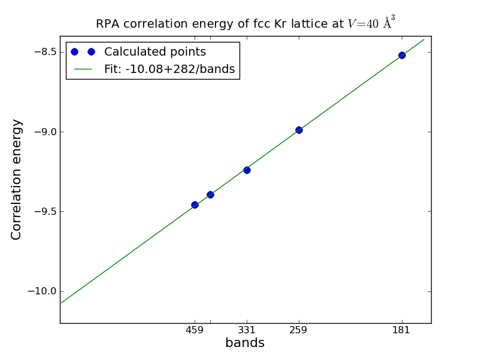
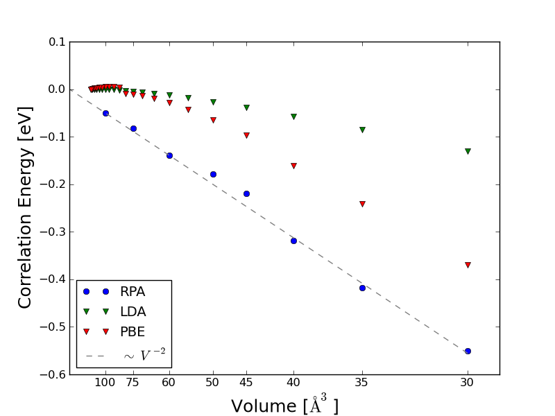

.. _rpa_tutorial:

==========================================================
Calculating RPA correlation energies
==========================================================

The Random Phase Approximation (RPA) can be used to derive a non-local expression for the ground state correlation energy. The calculation requires a large number of unoccupied bands and is significantly heavier than standard DFT calculation using semi-local exchange-correlation functionals. However, when combined with exact exchange the method has been shown to give a good description of van der Waals interactions as well as covalent bonds.

For details on the theory and implemenation we refer to :ref:`rpa`. Below we give an example on how to calculate the RPA correlation energy of Kr.

Example 1: Correlation energy of bulk Kr
=============================================

As an example we calculate the correlation energy of an fcc Krypton lattice with a unit cell volume of :math:`40\AA^3`

Ground state calculation
--------------------------

The response function needed for an RPA calculation is calculated in a plane wave basis where a cutoff energy determines the number of plane waves used. When calculating the correlation energy the number of plane waves needs to be set equal to the total number of bands and a cutoff is thus needed in order to set the number of bands in the ground state calculation.

The following script prints the number of bands corresponding to a cutoff of 300 eV::

    from ase import *
    from ase.structure import bulk
    from ase.units import Ha, Bohr
    from gpaw.response.cell import get_primitive_cell, set_Gvectors

    V = 40
    a0 = (4.*V)**(1/3.)
    Kr = bulk('Kr', 'fcc', a=a0)
    acell = Kr.cell / Bohr
    bcell = get_primitive_cell(acell)[0]
    gpts = [16,16,16]

    ecut = 300
    
    bands = set_Gvectors(acell, bcell, gpts, [ecut/Ha,ecut/Ha,ecut/Ha])[0]
    print bands

The output is 459 bands which should be produced from the ground state calculation. We then set up a script which starts by calculting the ground state density of Kr using a few extra bands and then do another calculation with fixed density and 459 converged unoccupied bands::

    from ase import *
    from ase.structure import bulk
    from gpaw import *

    V = 40
    a0 = (4.*V)**(1/3.)
    Kr = bulk('Kr', 'fcc', a=a0)

    calc = GPAW(h=0.18, xc='PBE', kpts=(6, 6, 6), nbands=8,
                txt='Kr_gs.txt')
    Kr.set_calculator(calc)
    Kr.get_potential_energy()

    calc.set(nbands=510, eigensolver='cg', fixdensity=True,
             convergence={'bands': -50})
    Kr.get_potential_energy()

    calc.write('Kr_gs.gpw', mode='all')

Note that for the large non-selfconsistent calculation, we use the conjugate gradient eigensolver, which is better suited for converging many unoccupied states. It also helps the eigensolver to include the 50 extra states, which are not converged.

Converging the frequency sampling
---------------------------------

The expression for the RPA correlation energy involves an integration over positive frequencies and a summation over q-points, which both need to be converged. The q-points are obtained from the k-points in the ground state calculation and typically, the rules of thumb for sampling the brillouin zone in LDA or GGA calculations also apply for RPA calculations.

To check convergence of the frequency sampling, we start by calculating the correlation energy at two different q-points without performing the frequency integration. This is done in the following script, which takes about five minutes::

    from ase import *
    from ase.parallel import paropen
    from gpaw import *
    from gpaw.mpi import serial_comm
    from gpaw.xc.rpa_correlation_energy import RPACorrelation
    import numpy as np

    ws = np.linspace(0.0, 400.0, 128)  # Frequency list
    ecut = 50                          # cutoff energy

    calc = GPAW('Kr_gs.gpw', communicator=serial_comm, txt=None)
    rpa = RPACorrelation(calc, txt='single_q.txt')

    E_1 = rpa.get_E_q(ecut=ecut, 
                      w=ws, 
                      integrated=False,
                      q=[0,0,0])

    f = paropen('q_1.dat', 'w')
    for w, E in zip(ws, E_1):
        print >> f, w, E.real
    f.close()

    E_2 = rpa.get_E_q(ecut=ecut, 
                      w=ws, 
                      integrated=False,
                      q=[0.5, 0.5, 0.5])

    f = paropen('q_2.dat', 'w')
    for w, E in zip(ws, E_2):
        print >> f, w, E.real
    f.close()

The script takes roughly five minutes on a single cpu. The files q_1.dat and q_2.dat stores the frequency dependent correlation energy at the considered q-points. The get_E_q function returns the correlation energy at the given q-point (must be a difference between k-points in the ground state calculation), and the integrated=False keyword implies that the energy should not be integrated. 

To check the dependence on frequency sampling, one can run the following script, which prints and plots the energy as a function of frequency using different samplings::
    
    import pylab as pl
    import numpy as np

    A = np.loadtxt('q_1.dat').transpose()

    for i in [1,2,4,8]:

        ws = A[0,::i]
        Eq_w = A[1,::i]

        dw = ws[1] - ws[0]
        Eq = dw * np.sum((Eq_w[:-1]+Eq_w[1:])/2.) / (2.*np.pi)

        print 'dw: ', dw, 'E_q: ', Eq

        pl.plot(ws, Eq_w, label='dw = %s' % dw)

    for i in [128,96,64,32,16]:
        ws = A[0,:i]
        Eq_w = A[1,:i]

        dw = ws[1] - ws[0]
        Eq = dw * np.sum((Eq_w[:-1]+Eq_w[1:])/2.) / (2.*np.pi)

        print 'w_max: ', i*400/128., 'E_q: ', Eq

    pl.xlabel('Frequency [eV]')
    pl.ylabel('Eq(w) [eV]')
    pl.axis([0,50,None,None])
    pl.legend(loc='lower right')
    pl.show()

The result is shown in the following table (all number in eV) for q = [0,0,0]

========================  =========================  =============
:math:`\Delta\omega`      :math:`\omega_{max}`       :math:`E_q`
========================  =========================  =============
 3.15	          		400	 	        -4.386
 6.30	   	   		400	                -4.387    
12.60	   			400			-4.418    
25.20				400			-4.938
 3.15	          		400	 	        -4.386
 3.15	          		300	 	        -4.386
 3.15	          		200	 	        -4.383
 3.15	          		100	 	        -4.358
 3.15	          		 50	 	        -4.199
========================  =========================  =============

For an accuracy of 10 meV, a sampling of :math:`\Delta\omega=6.3\,eV` and  :math:`\omega_{max}=200\,eV` is seen to be sufficient. This is the default sampling for RPA correlation energies. It should be noted, however that in order to save time, we use a rather low cutoff energy here and the test should in principle be made at :math:`\omega_{max}=300\,eV` used below. Presently only equidistant frequency sampling is implemented, but a more intelligent sampling may significantly reduce the number of frequency points needed.

Obtaining the RPA correlation energy
------------------------------------

It is not possible to fully converge the RPA correlation energy with respect to the energy and number of unoccupied bands, but the results of a few calculations are easily extrapolated to the value corresponding to infinite cutoff. The following script calculates the RPA correlation energy for a few cutoff energies (the number of bands in the calculation is equal to the number of plane waves defined by the cutoff)::

    from ase import *
    from ase.parallel import paropen
    from gpaw import *
    from gpaw.mpi import serial_comm
    from gpaw.xc.rpa_correlation_energy import RPACorrelation
    import numpy as np

    w = np.linspace(0.0, 200.0, 32)

    calc = GPAW('Kr_gs.gpw', communicator=serial_comm, txt=None)
    rpa = RPACorrelation(calc, txt='extrapolate.txt')

    for ecut in [150, 175, 200, 225, 250, 275, 300]:
        E_rpa = rpa.get_rpa_correlation_energy(ecut=ecut, w=w, kcommsize=8)

        f = paropen('extrapolate.dat', 'a')
        print >> f, ecut, rpa.nbands, E_rpa
        f.close()

 The script takes 35 hours on 8 Intel Xeon X5570 2.93GHz CPUs. The kcommsize=8 keyword tells the calculator to use 8 k-point domains and the calculation is thus fully parallelized over k-points. If the number of cpus is larger than kcommsize, parallelization over freqency points will be initiated, which is much less efficient than k-point parallelization. However, the memory consumption may sometimes be exceedingly high since the full response function is stored in all frequency points and parallelizing over frequencies may then be useful. When choosing a parallelization scheme, it should be noted that the response function involves a sum over all k-points and not just those in the irreducible part of reciprocal space. The total number of cpus should be equal to the number of frequency domains (divisible in frequency points) times the number of k-point domains (specified by kcommsize).

The result can be plotted with the script:: 

    import numpy as np
    from pylab import *

    A = np.loadtxt('extrapolate.dat').transpose()
    xs = np.array([170 +i*100. for i in range(500)])

    plot(A[1]**(-1.), A[2], 'o', markersize=8, label='Calculated points')
    plot(xs**(-1), -10.08+281.705/xs, label='Fit: -10.08+282/bands')
    t = [int(A[1,i]) for i in range(len(A[1]))]
    t[3] = ''
    xticks(A[1]**(-1.), t)
    xlabel('bands', fontsize=16)
    ylabel('Correlation energy', fontsize=16)
    axis([0.,None,None,None])
    title('RPA correlation energy of fcc Kr lattice at $V=40\,\AA^3$')
    legend(loc='upper left')
    show()

and is shown below. The calculated points are very well fitted by a function of the form: :math:`E_c(n)=E_c^{RPA}+A/n` where :math:`n` is the number of bands (defined by the cutoff values) and we can read off an RPA correlation energy of -10.08 eV. 

One can proceed like this for a range of different unit cell volumes and obtain the figure below. Here the correlation energy of an isolated Kr atom (the value extrapolated to infinite volume) has been subtracted from the plotted values. One sees a clear :math:`V^{-2}` dependence, which is characteristic of van der Waals bonded systems.

In order to obtain the total energy, the correlation energy should be added to the Hartree-fock energy, which can be obtained (non-selfconsistently) by::

    from gpaw import *
    from gpaw.xc.hybrid import HybridXC

    calc = GPAW('Kr_gs.gpw')
    E = calc.get_potential_energy()
    print E + calc.get_xc_difference(HybridXC('EXX'))
